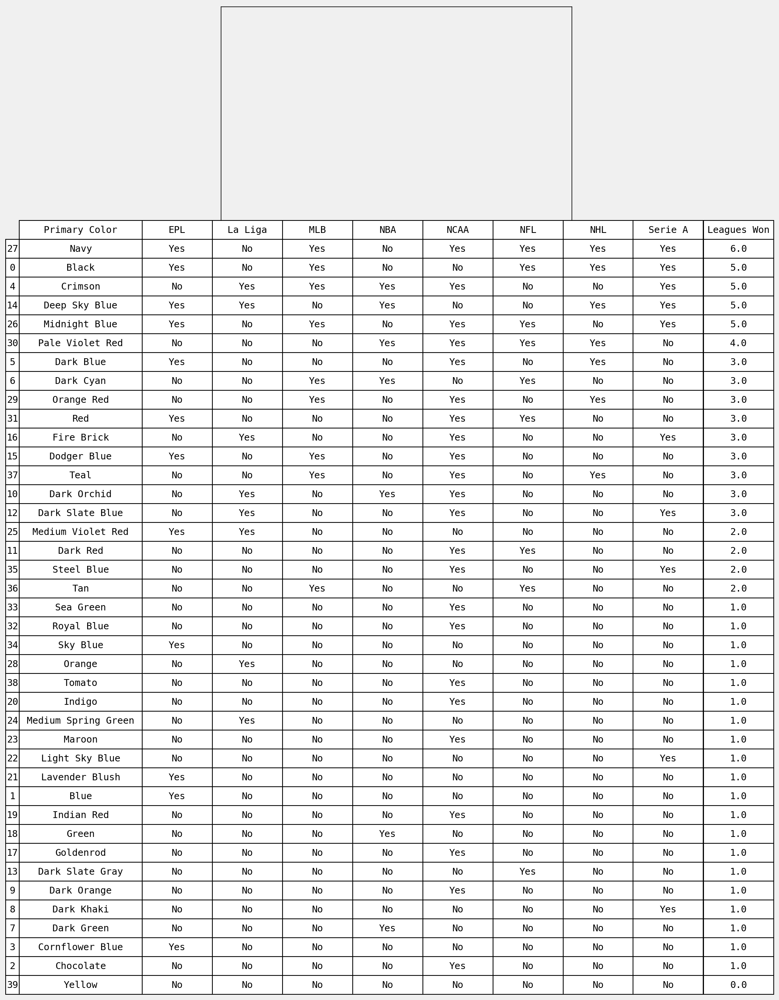

# Do team colors influence sports success?

I was recently listening to a podcast where the hosts were discussing Super Bowl LIV and what color each team would wear. Now, this discussion would typically be obvious but in this matchup, both the KC Chiefs and SF 49ers have colorways consisting of some shade of red, yellow, and white.

Once it was determined who the home team was and that their home jersey was red, one of the hosts said something like: "*That's their advantage. They get to wear red. Red is a dominant color*." They then had floated the idea of looking into the #'s of colors ans success, **so that's what we'll be looking into.**

##### The Data
To put this together, I scraped team primary + secondary colors (in hex) from [teamcolorcodes.com](https://teamcolorcodes.com/) for the MLB, NBA, NFL, NHL, Premier League (EPL), La Liga, Serie A, and the NCAA (Basketball + Football). These colors were by no means perfect for each team but they serve as a decent baseline.
* Furthermore, I used the [webcolors](https://webcolors.readthedocs.io/en/1.10/) package to convert the hex colors into both CSS2 and CSS3 color names.
* As well, I used the [wolframalpha](https://pypi.org/project/wolframalpha/) api to get english color names via the wolfram engine.

Lastly, I scraped Wikipedia for some tables of leagues, teams & their number of championships.

Let's get into it.

### Importing packages, data, and creating some plotting helpers


```python
# importing packages
import pandas as pd
import numpy as np
import matplotlib.pyplot as plt
import matplotlib.ticker as ticker
import seaborn as sns
import glob
import os
import warnings
warnings.filterwarnings('ignore')

%matplotlib inline

# set styles
plt.rcParams["font.family"] = "monospace"
plt.rcParams["axes.facecolor"] = "#F0F0F0"
plt.rcParams["figure.facecolor"] = "#F0F0F0"
```


```python
# import data
colors = pd.read_csv('data/team_colors.csv')

# union the csvs from each league together
champs_glob = glob.glob(os.path.join('data/champs', "*.csv"))
df_from_each_file = (pd.read_csv(f) for f in champs_glob)
all_champs = pd.concat(df_from_each_file, ignore_index=True)

# join champions csv to the color csv on Team + League
data = colors.merge(all_champs, how = "right", on = ["Team", "League"])

# narrow down to teams that've won championshps
winners = data[data["Wins"] > 0]

# couldn't get the damn emojis to render
# winners = winners.replace({"EPL": "EPL⚽","La Liga": "La Liga⚽","Serie A": "Serie A⚽","NFL": "NFL🏈",
#                           "NBA": "NBA🏀","NHL": "NHL🏒","MLB": "MLB⚾","NCAA": "NCAA🏈🏀"})
# for tick in ax.get_xticklabels(): tick.set_fontname("Segoe UI Emoji")

winners.head()
```


<div>
<style scoped>
    .dataframe tbody tr th:only-of-type {
        vertical-align: middle;
    }

    .dataframe tbody tr th {
        vertical-align: top;
    }

    .dataframe thead th {
        text-align: right;
    }
</style>
<table border="1" class="dataframe">
  <thead>
    <tr style="text-align: right;">
      <th></th>
      <th>Team</th>
      <th>hex_Primary_Color</th>
      <th>hex_Secondary_Color</th>
      <th>League</th>
      <th>wc_css2_Primary_Name</th>
      <th>wc_css2_Secondary_Name</th>
      <th>wc_css3_Primary_Name</th>
      <th>wc_css3_Secondary_Name</th>
      <th>wa_Primary_Names</th>
      <th>wa_Secondary_Names</th>
      <th>wa_Primary_Name_1</th>
      <th>wa_Primary_Name_2</th>
      <th>wa_Secondary_Name_1</th>
      <th>wa_Secondary_Name_2</th>
      <th>Wins</th>
    </tr>
  </thead>
  <tbody>
    <tr>
      <th>2</th>
      <td>Baltimore Ravens</td>
      <td>#241773</td>
      <td>#000000</td>
      <td>NFL</td>
      <td>Navy</td>
      <td>Black</td>
      <td>Midnightblue</td>
      <td>Black</td>
      <td>midnight blue,navy</td>
      <td>black,dim gray</td>
      <td>Midnight Blue</td>
      <td>Navy</td>
      <td>Black</td>
      <td>Dim Gray</td>
      <td>2</td>
    </tr>
    <tr>
      <th>5</th>
      <td>Chicago Bears</td>
      <td>#0B162A</td>
      <td>#C83803</td>
      <td>NFL</td>
      <td>Black</td>
      <td>Red</td>
      <td>Black</td>
      <td>Firebrick</td>
      <td>midnight blue,steel blue</td>
      <td>orange red,chocolate</td>
      <td>Midnight Blue</td>
      <td>Steel Blue</td>
      <td>Orange Red</td>
      <td>Chocolate</td>
      <td>1</td>
    </tr>
    <tr>
      <th>8</th>
      <td>Dallas Cowboys</td>
      <td>#041E42</td>
      <td>#869397</td>
      <td>NFL</td>
      <td>Navy</td>
      <td>Gray</td>
      <td>Midnightblue</td>
      <td>Lightslategray</td>
      <td>navy,dark blue</td>
      <td>light slate gray,slate gray</td>
      <td>Navy</td>
      <td>Dark Blue</td>
      <td>Light Slate Gray</td>
      <td>Slate Gray</td>
      <td>5</td>
    </tr>
    <tr>
      <th>9</th>
      <td>Denver Broncos</td>
      <td>#002244</td>
      <td>#FB4F14</td>
      <td>NFL</td>
      <td>Navy</td>
      <td>Red</td>
      <td>Midnightblue</td>
      <td>Orangered</td>
      <td>navy,teal</td>
      <td>orange red,chocolate</td>
      <td>Navy</td>
      <td>Teal</td>
      <td>Orange Red</td>
      <td>Chocolate</td>
      <td>3</td>
    </tr>
    <tr>
      <th>11</th>
      <td>Green Bay Packers</td>
      <td>#203731</td>
      <td>#FFB612</td>
      <td>NFL</td>
      <td>Black</td>
      <td>Orange</td>
      <td>Darkslategray</td>
      <td>Orange</td>
      <td>dark slate gray,cadet blue</td>
      <td>orange,dark orange</td>
      <td>Dark Slate Gray</td>
      <td>Cadet Blue</td>
      <td>Orange</td>
      <td>Dark Orange</td>
      <td>4</td>
    </tr>
  </tbody>
</table>
</div>


For plotting, let's create dictionaries that map each named color to their hex value. This will make it easy for to plot the correct color per name. `make_color_dict` functionalizes this process.


```python
def make_color_dict(color_name_header):
    if "Primary" in color_name_header: 
        colors = "hex_Primary_Color"
    else:
        colors = "hex_Secondary_Color"
        
    color_dict = pd.Series(winners[colors].values, index = winners[color_name_header]).to_dict()
    return color_dict

# css colors
webcolors_css2_p = make_color_dict("wc_css2_Primary_Name")
webcolors_css2_s = make_color_dict("wc_css2_Secondary_Name")
webcolors_css3_p = make_color_dict("wc_css3_Primary_Name")
webcolors_css3_s = make_color_dict("wc_css3_Secondary_Name")
# wolfram colors
wolfram_p_1 = make_color_dict("wa_Primary_Name_1")
wolfram_p_2 = make_color_dict("wa_Primary_Name_2")
wolfram_s_1 = make_color_dict("wa_Secondary_Name_1")
wolfram_s_2 = make_color_dict("wa_Secondary_Name_2")
```

## Colors of the Champions, per league

Before looking at color trends *across all* sports, it would be nice to see what the distribution of champion colors looks like league by league. Our first look is going to be the CSS2 names of the **primary** colors of champions. Why CSS2? The colors are very basic and should give us a high-level look:


```python
fig, ax = plt.subplots(figsize=(10, 4), dpi=150)

# plot
g = sns.swarmplot(data = winners.groupby(["wc_css2_Primary_Name", "League"])["Wins"].sum().reset_index(),
                  x="League", y="Wins",
                  hue="wc_css2_Primary_Name",
                  palette=webcolors_css2_p,
                  size = 10)
# text
plt.title('Championships won per CSS2 color', x=0.19, y=1.05, fontsize=12, weight="bold")
plt.xlabel("")
plt.ylabel("Number of Championships\n")
# annotate
plt.text(0.5,-12, 'Source: hex colors via teamcolors.com / championships via wikipedia / color names via webcolors | © Jeremy Fields 2020', fontsize=6)

# styling
g.legend(loc='center left', bbox_to_anchor=(1, 0.5), frameon=False)
plt.yticks(color="gray")
plt.tick_params(length=0)
sns.despine(left=True, bottom=True)
g.grid(b=True, which='major', axis="y", color='lightgray', linewidth=1.0, alpha=0.5)
```


If you're familiar with any of these leagues, you can make some assumptions as to which teams dominate the colors of each league. Off the top of my head:
* EPL - Man U/Arsenal/Liverpool
* MLB - Yankees/Dodgers
* NBA - Celtics/Lakers
* NHL - Red Wings
* Serie A - Juventus

One thing that irks me in these color names is the classification of yellows as "Orange". We can hopefully solve this, as well as get more granularity, by looking at the color names from wolfram alpha. This feature has 30 unique color values vs. the 11 above:


```python
fig, ax = plt.subplots(figsize=(10, 5), dpi=150)

# plot
g = sns.swarmplot(data = winners.groupby(["wa_Primary_Name_1", "League"])["Wins"].sum().reset_index(),
                  x="League", y="Wins",
                  hue="wa_Primary_Name_1", 
                  palette=wolfram_p_1,
                  size = 10,
                  alpha = 0.8)
# text
plt.title('Championships won per wolfram alpha color', x=0.28, y=1.05, fontsize=14, weight="bold")
plt.xlabel("")
plt.ylabel("Number of Championships\n")
# annotate
plt.text(0.5,-10, 'Source: hex colors via teamcolors.com / championships via wikipedia / color names via wolfram alpha | © Jeremy Fields 2020', fontsize=8)

# styling
g.legend(loc='center left', bbox_to_anchor=(1, 0.5), frameon=False, ncol=2)
g.grid(b=True, which='major', axis="y", color='lightgray', linewidth=1.0, alpha=0.5)
plt.yticks(color="gray")
plt.tick_params(length=0)
plt.ylim(-1, 60)
sns.despine(left=True, bottom=True)
```


Nice! We have a lot more color to this analysis both literally and figuratively. We can still see a lot of the trends that were in the previous plot...but more nuance as well. Some leagues still have some dominant colors (of which Crimson is in 3) but now it's hard to tell what other colors the winners wear.

How about we look at these colors across all leagues to see which color wins the most championships?


```python
fig, ax = plt.subplots(figsize=(4, 5), dpi=150)

# plot
g = sns.barplot(data = winners.groupby(["wa_Primary_Name_1"])["Wins"].
                       sum().
                       reset_index().
                       sort_values(by = ["Wins"], ascending=False),
                x = "Wins", y = "wa_Primary_Name_1",
                hue = "wa_Primary_Name_1", palette = wolfram_p_1, alpha=0.8, dodge=False)
# text
plt.title('Championships per primary color', x=0.5, y=1.05, fontsize=10, weight="bold")
plt.ylabel("")
plt.xlabel("")
# annotate
plt.text(100,20, 'Source: hex colors via teamcolors.com\n        championships via wikipedia\n        color names via wolfram alpha\n        © Jeremy Fields 2020', fontsize=4)

# styling
g.legend_.remove()
g.tick_params(color="gray")
plt.xlim(0, 175)
plt.tick_params(axis="y", length=0)
plt.xticks(color="gray", size=6)
plt.yticks(size = 6)
ax.spines['bottom'].set_color('gray')
ax.spines['top'].set_color('gray')

# add 2nd x-axis to top
axT = ax.twiny()
axT.set_xlim(0, 175)
axT.xaxis.set_major_locator(ticker.MultipleLocator(25))
axT.tick_params(axis='x', colors="gray", labelsize=6)
axT.spines['top'].set_color('gray')
axT.spines['bottom'].set_color("gray")
sns.despine(left=True, top=False)
```


The podcast host wasn't wrong. Red (Crimson) is *by far* the most trophied color across all leagues.

This didn't solve our "Orange" problem, but it's easy enough to just call it yellow in our heads. Same thing goes with "Navy" which is more of a purple. That one being so high on the list surprised me. Lakers maybe?

For the sake of curiousity, let's look at the secondary colors of these winners.


```python
fig, ax = plt.subplots(figsize=(4, 5), dpi=150)

# plot
g = sns.barplot(data = winners.groupby(["wa_Secondary_Name_1"])["Wins"].
                       sum().
                       reset_index().
                       sort_values(by = ["Wins"], ascending=False),
                x = "Wins", y = "wa_Secondary_Name_1",
                hue = "wa_Secondary_Name_1", palette = wolfram_s_1, alpha=0.8, dodge=False)
# text
plt.title('Championships per secondary color', x=0.5, y=1.05, fontsize=10, weight="bold")
plt.ylabel("")
plt.xlabel("")
# annotate
plt.text(100,20, 'Source: hex colors via teamcolors.com\n        championships via wikipedia\n        color names via wolfram alpha\n        © Jeremy Fields 2020', fontsize=4)

# styling
g.legend_.remove()
g.tick_params(color="gray")
plt.xlim(0, 175)
plt.tick_params(axis="y", length=0)
plt.xticks(color="gray", size=6)
plt.yticks(size = 6)
ax.spines['bottom'].set_color('gray')
ax.spines['top'].set_color('gray')

# add 2nd x-axis to top
axT = ax.twiny()
axT.set_xlim(0, 175)
axT.xaxis.set_major_locator(ticker.MultipleLocator(25))
axT.tick_params(axis='x', colors="gray", labelsize=6)
axT.spines['top'].set_color('gray')
axT.spines['bottom'].set_color("gray")
sns.despine(left=True, top=False)
```


Black and red are still dominant here but we have some new ones!
* Goldenrod making a showing isn't something I'd expect, but it could belong to a team with a basic primary color with a lot of wins
* The whites, blacks and grays really don't come as much of a suprise
* There are a lot of neutrals in this palette

This has been a pretty fun exercise. Red clearly rules. Black too. No surprise as they're pretty *mean* colors which must add some kind of an edge to performance.

## Appendix

In the following cells I output what primary colors have wins in each league. This will reduce the effect of a team having a ton of wins in one league and skewing the counts (which was possibly happening in the bar charts above).


```python
def get_leagues_won_per_color(colorgroup):
    league_winners = league_winners = data[[colorgroup, "League", "Wins"]]
    league_winners["Has Won"] = np.where(league_winners["Wins"] > 0, 1, 0) # 1 = has won, 0 = has not
    league_winners = league_winners.drop_duplicates().sort_values(by=colorgroup)
    
    # pivot the leagues out and flatten the df
    color_table = league_winners.pivot_table(index=colorgroup, 
                                             columns="League", 
                                             values="Has Won", 
                                             aggfunc="first").fillna(0)

    color_table = pd.DataFrame(color_table.to_records())
    
    # calc the number of leagues each color has won in
    color_table["Leagues Won"] = color_table.drop(colorgroup, axis=1).sum(axis=1)
    # rename 1.0s to Yes, 0.0s to No
    cols = ["EPL", "La Liga", "MLB", "NBA", "NCAA", "NFL", "NHL", "Serie A"]
    color_table[cols] = color_table[cols].replace({0.0 : "No", 1.0 : "Yes"})
    # sort by num of leagues won
    color_table = color_table.sort_values(by=["Leagues Won"], ascending=False)
    
    return color_table

primary_color_table = get_leagues_won_per_color("wa_Primary_Name_1").rename(columns={"wa_Primary_Name_1": "Primary Color"})
secondary_color_table = get_leagues_won_per_color("wa_Secondary_Name_1").rename(columns={"wa_Secondary_Name_1": "Secondary Color"})
```


```python
fig, ax = plt.subplots(figsize=(8, 5), dpi=150)

# hide axes
ax.xaxis.set_visible(False) 
ax.yaxis.set_visible(False)

# table
table = plt.table(cellText=primary_color_table.values,
          rowLabels=primary_color_table.index,
          colLabels=primary_color_table.columns,
          cellLoc = 'center', rowLoc = 'center')

table.auto_set_font_size(False)
table.set_fontsize(12)
table.scale(2, 2)

# fit the color cells
cell_dict = table.get_celld()
    
for i in range(0, len(primary_color_table.index)+1):
    cell_dict[(i,0)].set_width(0.35)
```




