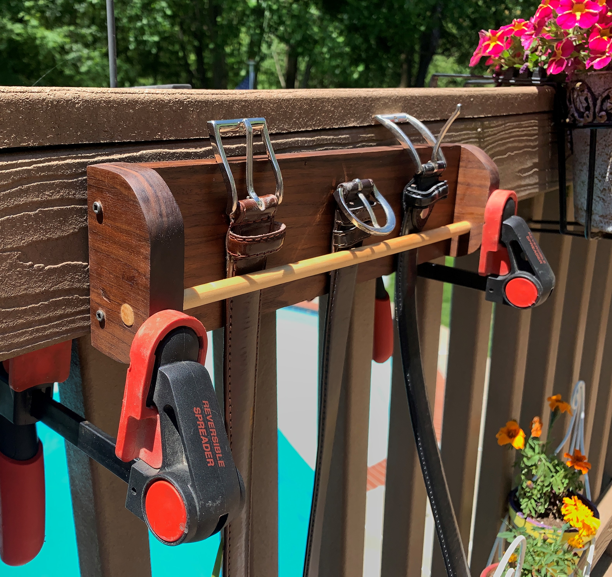

I only keep a few belts at a time and they usually end up stacked upon a hook. I can't tell you how many times I've had to pop 4 belts off a hook to get to the one I wanted.

I made a better solution.

Materials:
* 1/2" dowel, 9.5" in length
* Scrap walnut maybe 12"x3.5"
* Tung oil finish

This was a really simple design, comprised of a back plate, two side pieces and a dowel. I chose to round the side pieces but you could just get away with square cuts.

The key design point came to be how far the dowel would sit from the back plate. Too far and the belts would slip through, too close and they wouldn't fit in at all. I went with ~1/2" from the back plate and for me, it worked like a charm.

