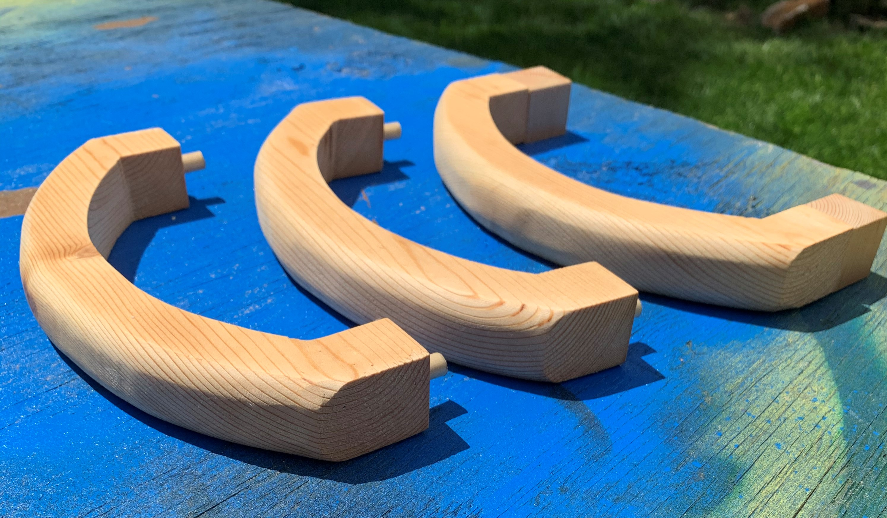
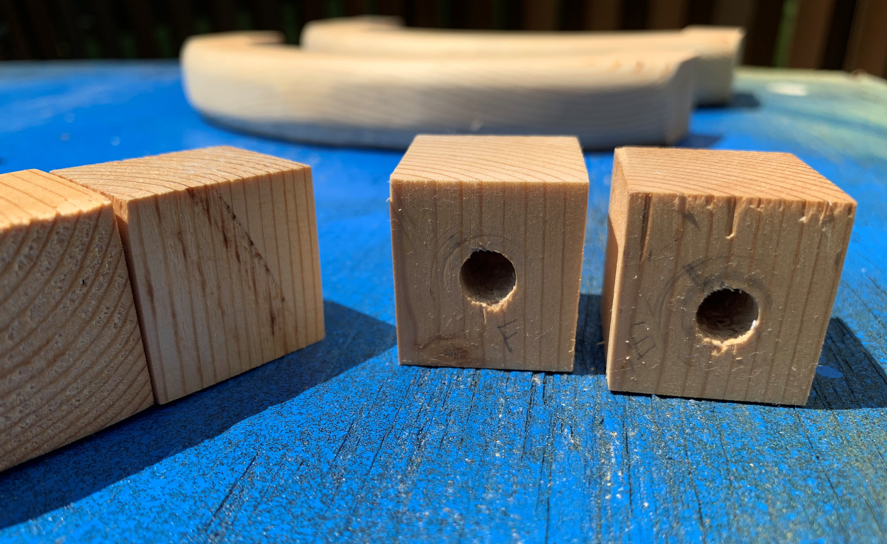
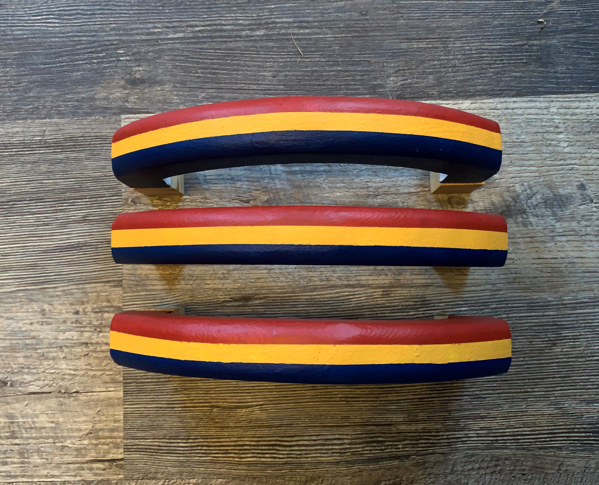
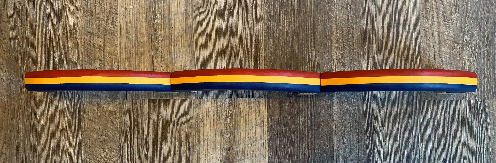
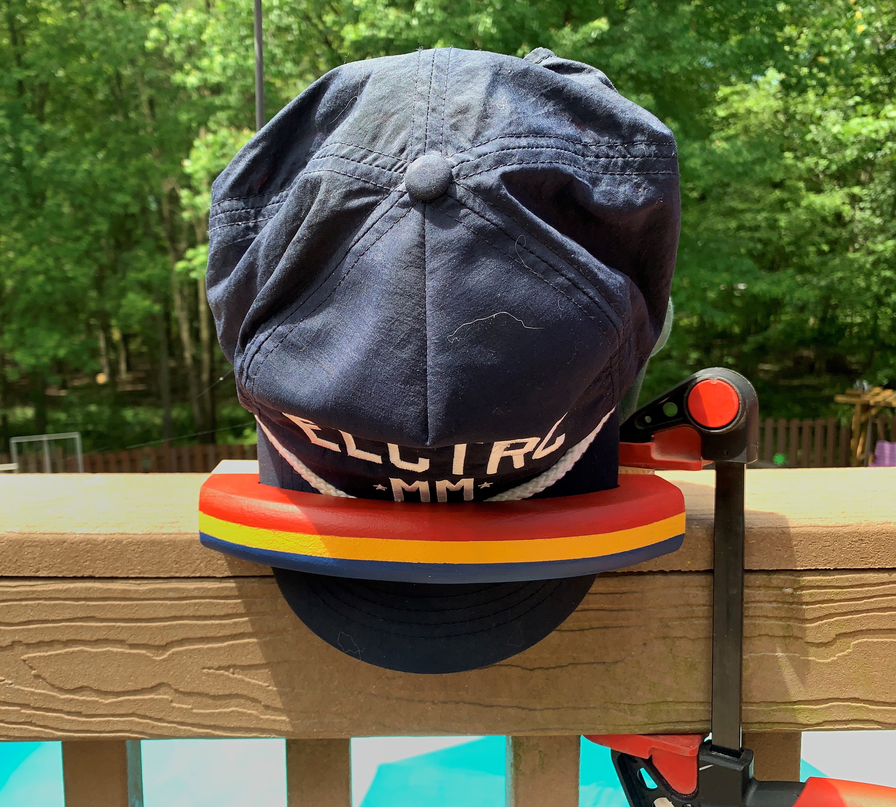
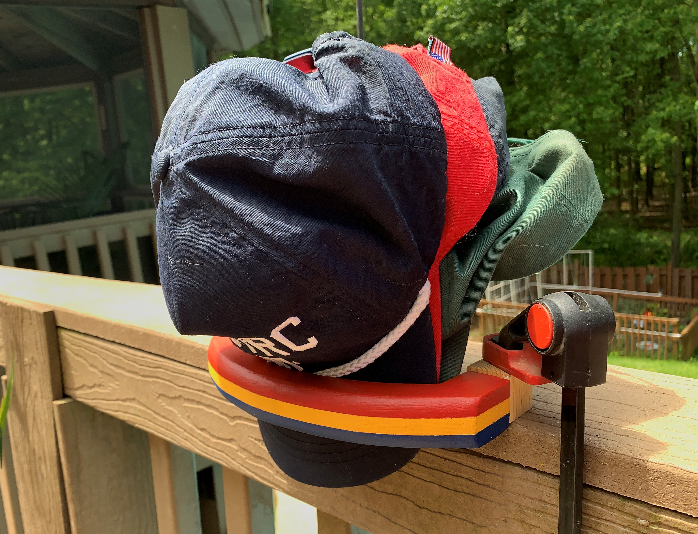

Tired of storing hats on whatever hooks and nails I could find, it was time to make a better solution. 

When designing the piece, I had three priorities. 
1. It had to be scalable - able to scale up or down depending on my stock of hats
2. It had to be modular - able to be mounted vertically or horizontally
3. It had to be compact - able to hold ~5 hats (per unit) within it's confines

As for materials, it took one piece of pine 2" x 6" for 3 units.

Dowels were inserted into the rear of the units. These dowels are meant to be inserted into small cubes which anchor into a wall, allowing the units to be easily removed.

Usually not into painting woodworking projects but decided to go with some retro-inspired stripes. In these pictures you can get a feel for the horizontal/vertical modularity of this build.

Here's an idea of how one unit will look in the wild. I've been able to easily do 6 hats per unit.

