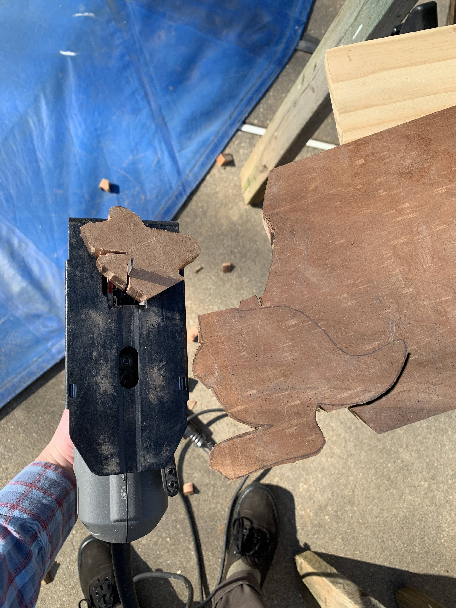
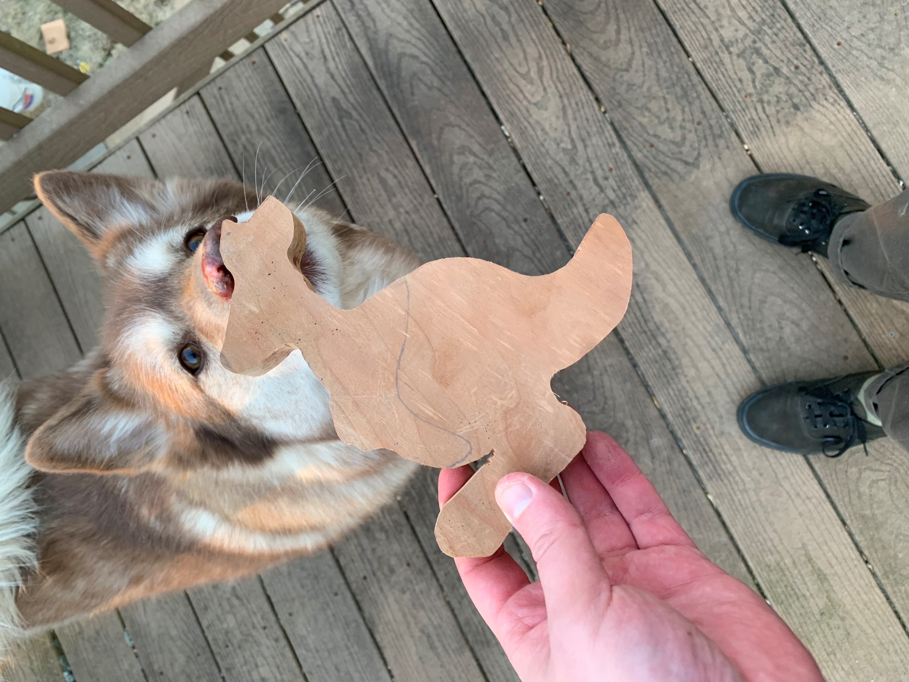
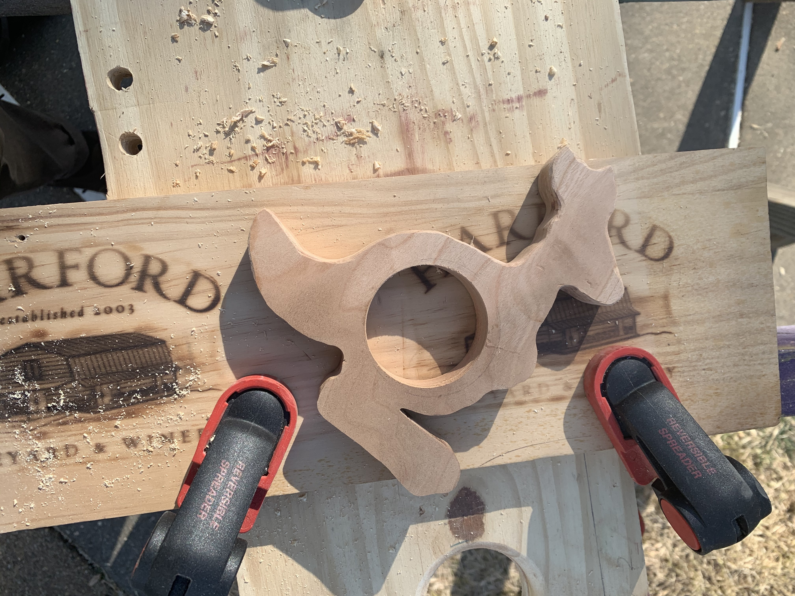
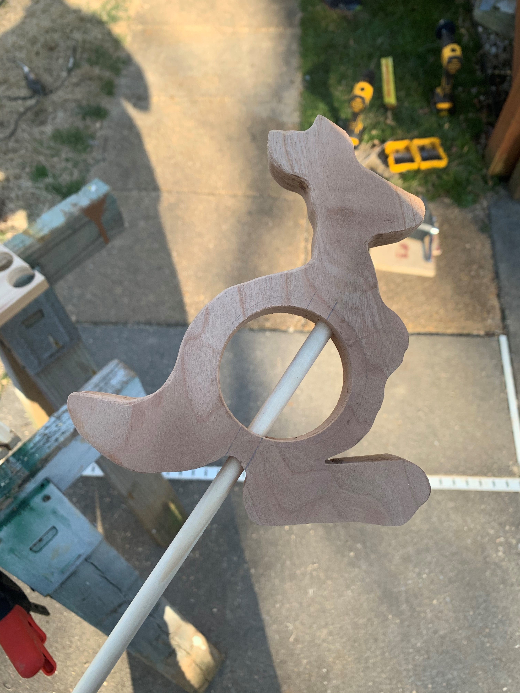
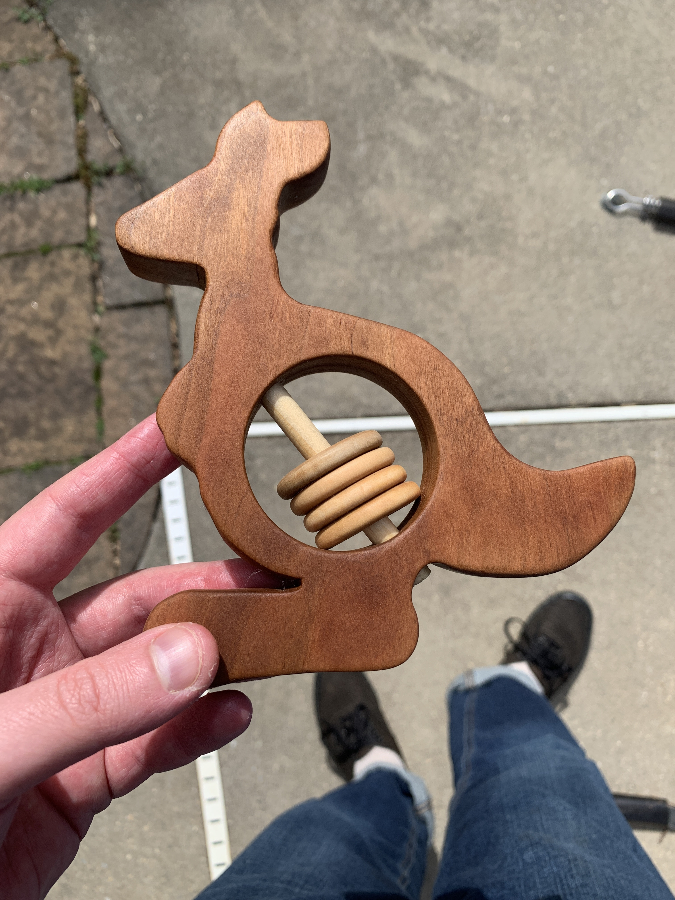
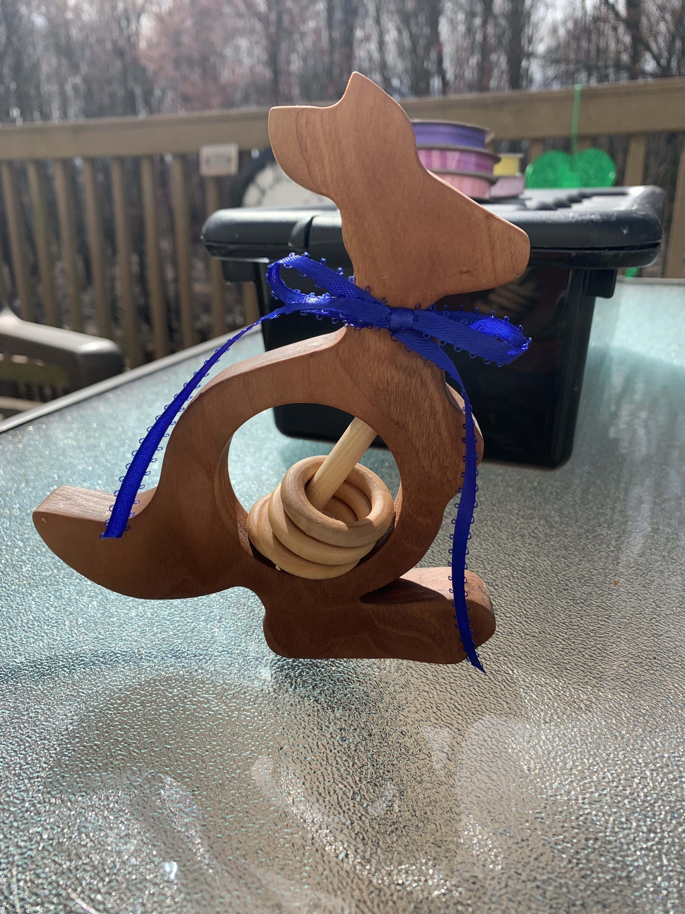

A domino was about to fall. My first close friend with a baby on the way.

With the little guy only a week away I got to working on a welcome to the world gift; a rattle in the shape of a kangaroo (his name was to be Joey).

I stenciled a cartoon kangaroo (with a big belly, this was **key**) onto a piece of walnut and turned, curved, and angled my way around the form. 

I made good headway on the piece, took a break, and got ready to finish cutting the head/neck out and

Brutal. BRUTAL. Some bad juju in the air after this. Not good.

Now that I had the form done on V2, I took a hole saw bit and popped a cavity right into the center of the 'roo. This is where the rattle-y bits would go.

Fueled by my rage over the V1 head snapping I took joy in sticking a dowel right through its center.

All that was left was to take some wooden rings I bought, throw them on the dowel and I had a rattle. Sanded and finished with some butcher block conditioner.

(the dowel nub was removed)

