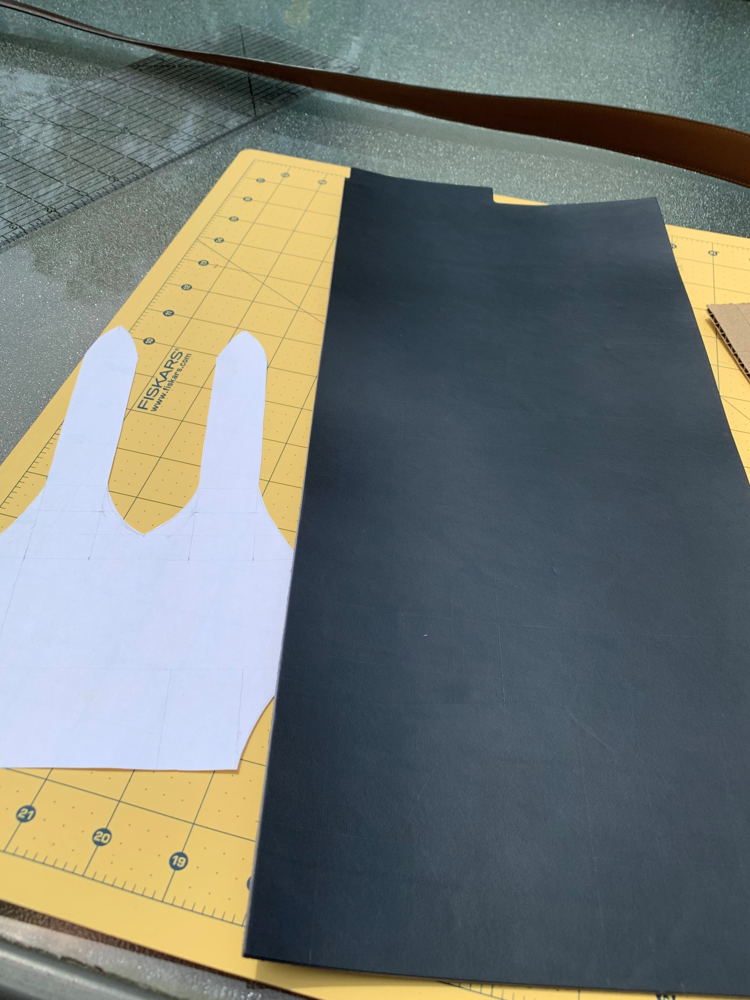
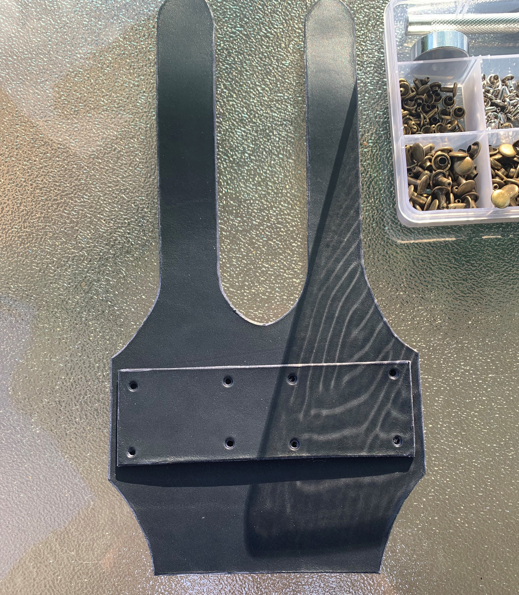
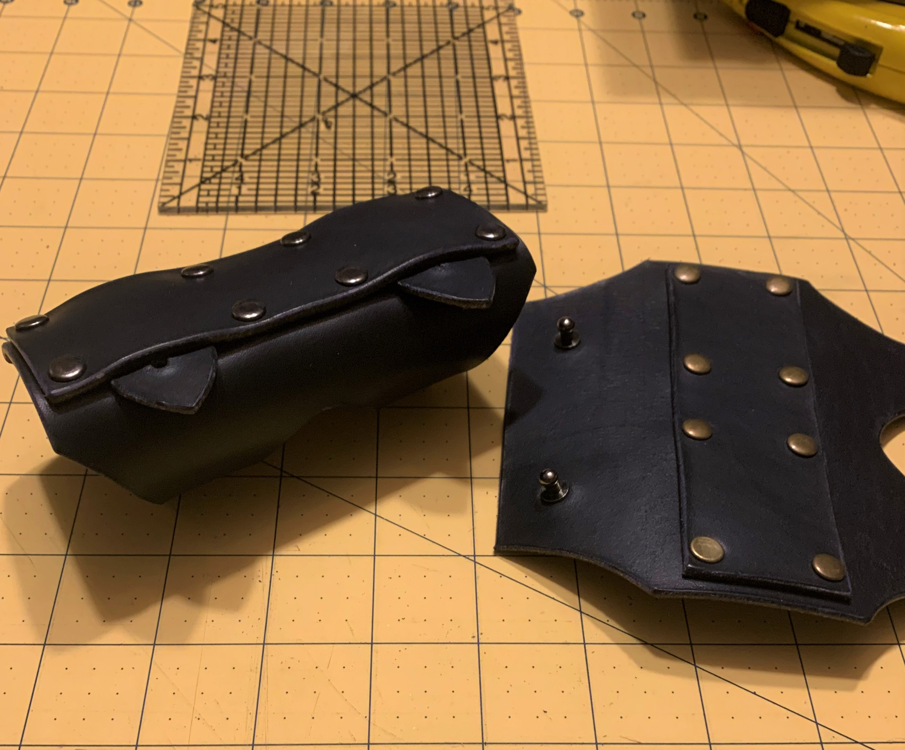

I doubt I would've ever tried to make something out of leather if it weren't for the coronavirus lockdown but here we are.

At the beginning of lockdown (early April) I bought my first road bike and fell in love instantly. I began to have that itch you get when you try something new and enjoy it: buy every accessory possible.

Given my awareness of this itch and knowing that I'd be having too much free time, I decided to make an accessory. I came across this [six pack holder](https://walnutstudiolo.com/products/6-pack-bicycle-frame-cinch) by walnut studios and was inspired to make a knockoff.

I bought an 8" x 18" cut of Grade A, 5oz, navy tanned Italian leather. No idea if this was the right stuff but it was ~Italian leather~.

I sketched out a prototype and cut the form using a box cutter with a fresh blade. That was mostly painless - wasn't the most dextrous tool for cutting curves. 

I made sure I had enough material to make two. Not because I needed two. Because I was ready for one to go wrong. I then cut two rectangles which would later serve as slips for excess straps.

At this point I was able to get an accurate measurement of the leather thickness allowing me to order rivets, studs, and some finishing tools. Fast forward 1 covid delivery delay.

Next up came the raw edge work; beveling and burnishing. I burnished this piece first with water, then with some parrafin wax (aka a candle).

Hole punching time. I went away at banging away ~15 holes on the first piece with a small metal punch. It wasn't until the 16th and final hole that I learned punching is much easier on the inner hide. By the time I made it to the second one my pop found an variable-width leather punch which worked like a dream.

All that was left was attaching the rivets, studs, and cutting slips into the strap holes to allow the studs to wiggle into place. Somehow someway I had two functioning utility straps.

This was a really fun project both for it's novelty and the learning experience. Having some, even if minor, mastery over a new material always feels rewarding.

