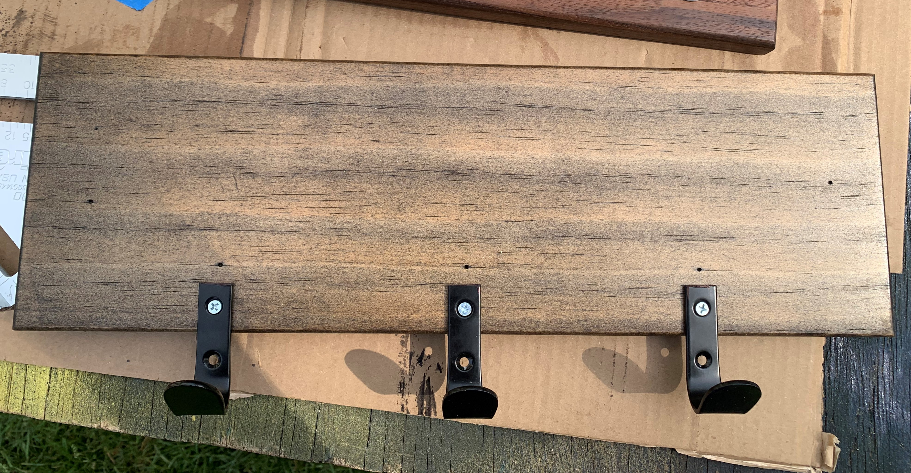

Quarantine project numero uno.

I keep a coin tray with various unorganized knick-knacks that go with me or stay depending on the day and sought to consolidate that into something more useful - a entryway/letter box.

My design priorities were to have the piece have a minimal profile and to use no visible hardware in the construction.

Materials:
* Some amount of yellow pine of various cuts and walnut. 
* Minwax Jacobean stain
* 1/4" dowels
* 3 hooks (did some cutting on these)

I first assembled the interior of the box. First, I cut the base, routed tracks for dividers and drilled dowel holes in the front-facing sides. Next, I cut the side pieces and mitre joined both the base and side pieces together.

Next, I cut the rear and front plates. The front plate was rounded over on both edge faces while the rear was rounded on the frontward face.

I then drilled dowel holes into the front plate and attached it to the inner base. 

From here, I attached 3 coat hooks to the bottom of the back plate and screwed the back into the base/front.

Lastly, I slid the dividers into their previously routed tracks, and voila!

In the wild (wear a mask).

